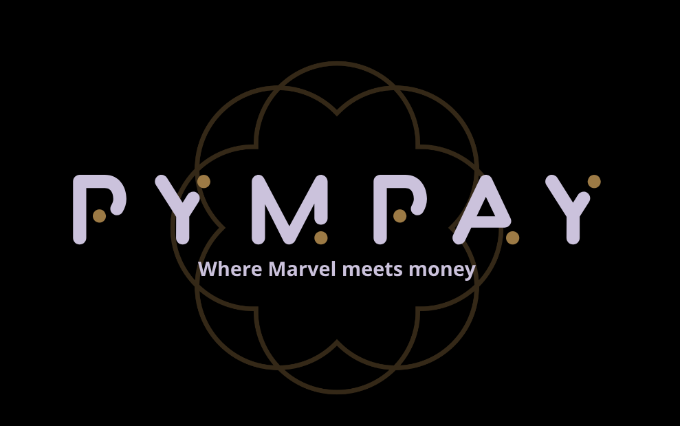

# Welcome to PymPay: Your Financial Universe 🌌

Introducing PymPay, where the world of finance meets the marvel of technology! Seamlessly blending the innovative spirit of Hank Pym (aka Ant-Man) with the convenience of modern online banking, PymPay is your gateway to effortless transactions, secure payments, and financial empowerment.

## Why Choose PymPay?

🔒 **Security**: Just as Pym's suit offers protection, PymPay ensures your transactions are shielded by cutting-edge security measures.

⚡ **Speed**: Experience swift transactions that rival Ant-Man's lightning-fast movements, making managing your finances a breeze.

💰 **Simplicity**: Navigating the PymPay universe is as simple as Hank Pym's famous catchphrase, "Pym Particles!" Enjoy an intuitive interface for all your financial needs.

🌐 **Global Reach**: With PymPay, your financial universe knows no bounds. Send and receive funds across galaxies with ease.

📈 **Growth and Control**: Like Pym's research, PymPay empowers you to control and grow your financial journey, unlocking opportunities as you go.

## Join the PymPay Movement

Become a part of the PymPay revolution and step into a world where finance and technology intertwine like never before. Unleash your financial potential with PymPay, the future of online banking.

> _PymPay: Where Marvel meets money._

## Description

- This application is built using PhP.
- It uses Apache servers. (MyPHPAdmin)
- Realtime updation.

## Guidelines on how to use and how to operate

- Coming soon 🚀 The styling and images are left.

## For contributing

Check the [Contributing page.](https://github.com/AdityaSeth777/PymPay/blob/master/Contributing.md)
Make sure to PR your changes in the development branch.

## .env file

This file contains various environment variables that you can configure.

**PORT** - Port to run your frontend.

<!--
1. Admin
    Email    : sysadmin@ibanking.com
    Password : admin

2. Staff
    Email    : staff@ibanking.com
    Password : demo

3. Client
    Create Client Account

!-->

## License

MIT License

Copyright (c) Aditya Seth

Permission is hereby granted, to any person obtaining a copy of this software and associated documentation files (the "Software"),to deal in the Software without restriction, including without limitation the rights to use, copy, modify, merge, publish, distribute, sublicense, and/or sell copies of the Software, and to permit persons to whom the Software is furnished to do so, subject to the following conditions:

The above copyright notice and this permission notice shall be included in all copies or substantial portions of the Software.

THE SOFTWARE IS PROVIDED "AS IS", WITHOUT WARRANTY OF ANY KIND, EXPRESS OR IMPLIED, INCLUDING BUT NOT LIMITED TO THE WARRANTIES OF MERCHANTABILITY, FITNESS FOR A PARTICULAR PURPOSE AND NON-INFRINGEMENT. IN NO EVENT SHALL THE AUTHORS OR COPYRIGHT HOLDERS BE LIABLE FOR ANY CLAIM, DAMAGES OR OTHER LIABILITY, WHETHER IN AN ACTION OF CONTRACT, TORT OR OTHERWISE, ARISING FROM, OUT OF OR IN CONNECTION WITH THE SOFTWARE OR THE USE OR OTHER DEALINGS IN THE SOFTWARE.
